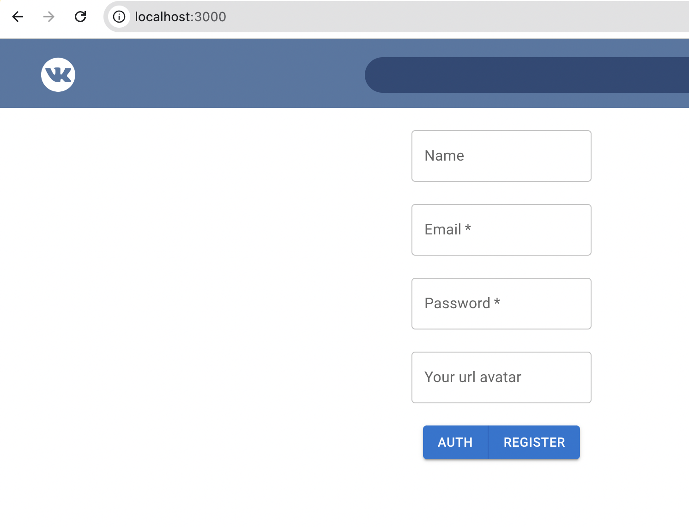
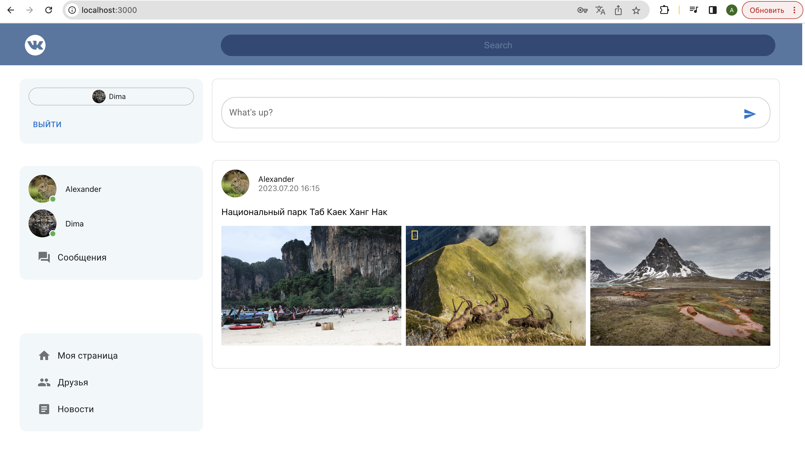
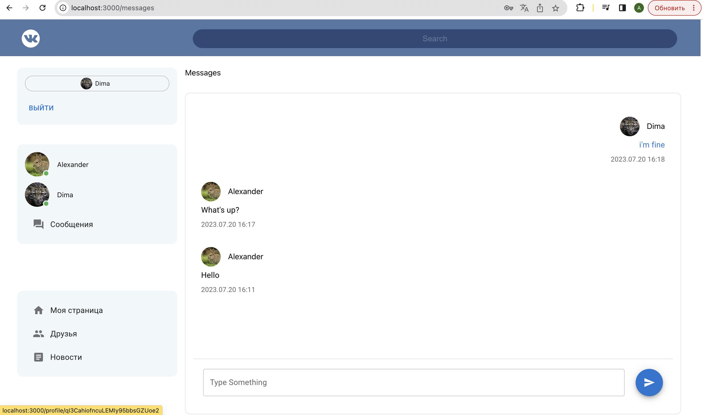
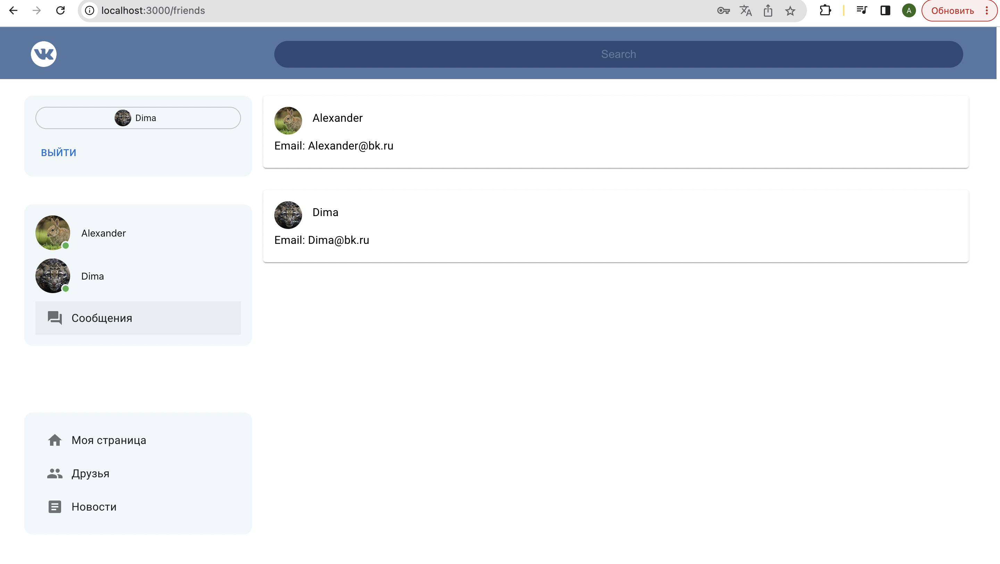

# Проект [VK](https://github.com/AlexFromNorth/vk) | Frontend / Firebase

### 📜 Описание:
Социальная сеть(ВК) на `React.js` для обмена сообщениями и новостями с возможность авторизации при использование `firebase`. Созданно с применением `Create React App` и имеет переиспользуемые компоненты. Применена методология БЭМ. 
В планах  улучшить визуальную часть, сделать переписки с каждым пользователем отдельно и добавить возможность в новостях ставить изображения.

### 📲 Как пользоватся:
* Придумайте логин и пароль, и зарегистрируйтесь

### ⚙️ Функционал:
* Single Page Application на Create React App в рамках одной страницы без перезагрузок.

* Отправку и получение сообщений
  
* Отправка постов в разделе "Новости"

* Для формы авторизации использовал Firebase с валидацией.


### 🥞 Стек:

`HTML5` `CSS3` `JavaScript ES6+` `React` `БЭМ (Nested)` `Material UI` `Firebase` `TypeScript`

### 💽 Установка и запуск:

1. Склонировать репозиторий в текущую папку:

```git clone https://github.com/AlexFromNorth/vk.git ./```

2. Установить зависимости:

```yarn install```

3. Запустить проект в режиме разработки:

```yarn start```
<br />
<br />

<br />
<br />

<br />
<br />

<br />
<br />
